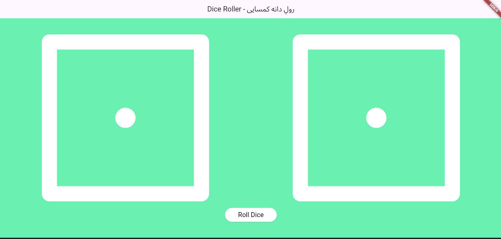

# 🎲 Dicee 4pplication

Welcome to **Dicee 4pplication** – the coolest and most beautiful dice roller app built with Flutter! 
Roll the dice, enjoy the animations, and bring a bit of luck to your day. The background color will amaze you just as it amazed me:) ✨

---

## 🚀 Features

- 🎲 **Random Dice Roller**: Tap to roll two dice at once!
- 🌈 **Vibrant UI**: Eye-catching colors and smooth animations.
- 📱 **Responsive Design**: Looks great on any device.
- 🏷️ **Multilingual Title**: English & Pashto for a local touch.

---

## 📸 Preview



---

## 🛠️ Getting Started

1. **Clone the repository:**
   ```bash
   git clone https://github.com/l1nuxd/dicee_4pplication.git
   cd dicee_4pplication
   ```

2. **Install dependencies:**
   ```bash
   flutter pub get
   ```

3. **Run the app:**
   ```bash
   flutter run
   ```

---

## 📂 Project Structure

```
lib/
  └── main.dart        # Main application code
images/
  └── dice1.png        # Dice face images (1-6)
  └── dice2.png
  └── dice3.png
  └── dice4.png        
  └── dice5.png
  └── dice6.png
  └── screenshot.png
```

---

> Made with ❤️ by Aminullah Habibi Wardak
