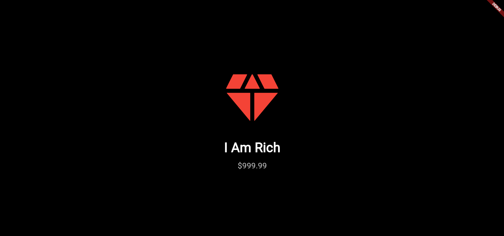

# 💎 i_am_riiich

[](https://flutter.dev/)
[](LICENSE)
[](https://github.com/yourusername/i_am_riiich/pulls)

A simple, fun Flutter app that shows how rich you are! Inspired by the classic Flutter "I Am Rich" demo.

---

## ✨ Features

- Beautiful, minimal UI
- Large, shiny diamond icon
- Customizable text and theme
- Responsive design for all devices

---

## 📱 Screenshot

<p align="center">
  
</p>

---

## 🚀 Getting Started

1. **Clone the repository**
   ```bash
   git clone https://github.com/l1nuxd/i_am_rich.git
   cd i_am_rich
   ```

2. **Install dependencies**
   ```bash
   flutter pub get
   ```

3. **Run the app**
   ```bash
   flutter run
   ```

---

## 🛠️ Built With

- [Flutter](https://flutter.dev/) - Cross-platform UI toolkit

---

## 📄 License

This project is [MIT](LICENSE) licensed.

---

## 🙏 Acknowledgements

- [Flutter Documentation](https://docs.flutter.dev/)
- Inspired by the original "I Am Rich" app
