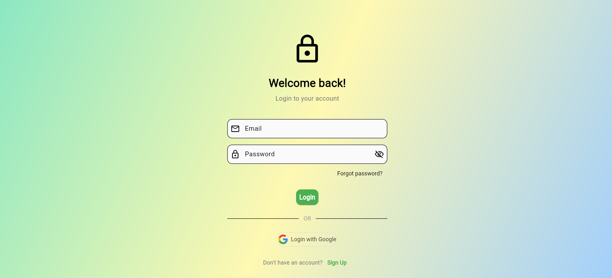
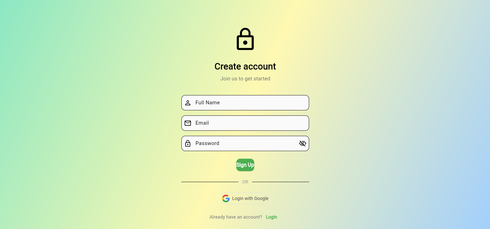

# 🚀 Flutter Login & Signup UI

A modern, professional, and beautiful Flutter application featuring a responsive Login and Signup interface. This project demonstrates clean UI design and smooth transitions between authentication screens.

## ✨ Features

- 🎨 Elegant Login and Signup screens
- 🖼️ SVG asset support for logos and icons
- ✅ Form validation with helpful error messages
- 🔒 Password obscuring and visibility toggle
- ❓ "Forgot password?" prompt
- 🔗 Social login button (Google)
- 📱 Responsive and mobile-friendly layout
- 🛠️ Customizable color scheme and fonts

## 📸 Screenshots

| Login Screen | Signup Screen |
|:------------:|:-------------:|
|  |  |


## 🏁 Getting Started

1. **Clone the repository:**  
   ```bash
   git clone https://github.com/yourusername/login___signup.git
   cd login___signup
   ```

2. **Install dependencies:**  
   ```bash
   flutter pub get
   ```

3. **Add assets:**  
   - 📂 Place your SVG assets (e.g., `wave.svg`, `google.svg`) in the `assets/` directory.
   - 📝 Update `pubspec.yaml` to include the assets.

4. **Run the app:**  
   ```bash
   flutter run
   ```

## 🛠️ Customization

- 🎨 Change primary and secondary colors in `main.dart` for your brand.
- 🖼️ Replace SVG assets with your own logos/icons.
- 🔗 Extend authentication logic to connect with your backend.

## 📂 Project Structure

```
lib/
  main.dart         # Main UI and logic
assets/
  google.svg        # Google icon SVG
  screenshots/      # App screenshots
```

## 🤝 Contributing

Contributions are welcome! Please open issues or submit pull requests for improvements. 🙌


> built with ❤️ by Aminullah Habibi Wardak
