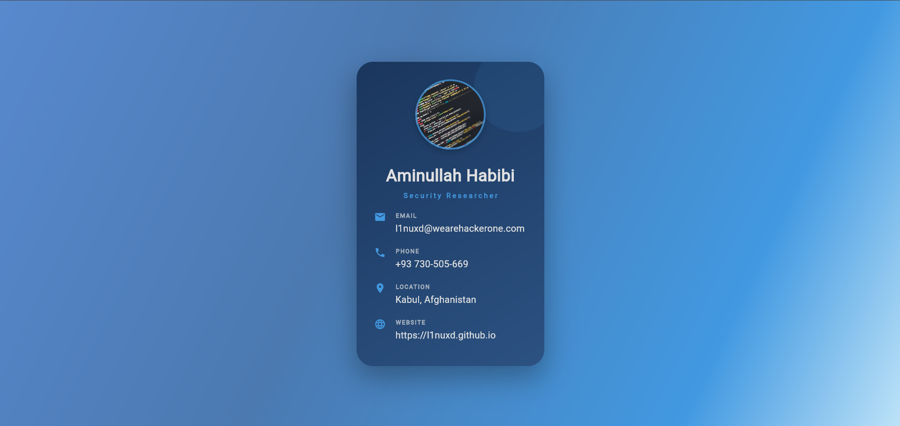

# 💼 Premium Profile Card

<p align="center">
  
</p>

<p align="center">
  <b>A beautiful, modern, and customizable digital business card built with Flutter.</b><br>
  <i>Showcase your professional profile with elegance and style.</i>
</p>

---

## 🎨 Features

- ✨ **Stunning Gradient Background** — Multi-stop blue gradients for a premium, eye-catching look.
- 🖼️ **Profile Photo** — Circular avatar with border, shadow, and smooth image loading.
- 📝 **Personal Info** — Name, title, and all your contact details.
- 📱 **Responsive Design** — Looks great on all devices and screen sizes.
- 🎛️ **Customizable** — Easily change colors, fonts, and content.
- 🌙 **Dark Mode Friendly** — Elegant and readable in any environment.
- ⚡ **Pure Flutter** — No third-party UI dependencies.

---

## 🚀 Getting Started

1. **Clone the repository**
   ```bash
   git clone https://github.com/l1nuxd/profile_card.git
   cd profile_card
   ```

2. **Install dependencies**
   ```bash
   flutter pub get
   ```

3. **Run the app**
   ```bash
   flutter run
   ```

---

## 🖌️ Customization

- **Profile Image:**  
  Change the image URL or use a local asset in `lib/main.dart` inside `PremiumBusinessCard`.
- **Personal Info:**  
  Edit your name, title, and contact details in the same widget.
- **Colors & Gradient:**  
  Tweak the gradient colors in the `BoxDecoration` for your own unique style.

---

## 🛠️ Built With

- [Flutter](https://flutter.dev/) — Build beautiful native apps in record time

---

## 🤝 Contributing

Contributions, issues and feature requests are welcome!  
Feel free to check [issues page](https://github.com/l1nuxd/profile_card/issues) if you want to contribute.

---

## 👤 Author

**Aminullah Habibi**  
[GitHub](https://github.com/l1nuxd) • [Website](https://l1nuxd.github.io)

---

## ⭐️ Show your support

If you like this project, please give it a ⭐️ on [GitHub](https://github.com/l1nuxd/profile_card)!

---
